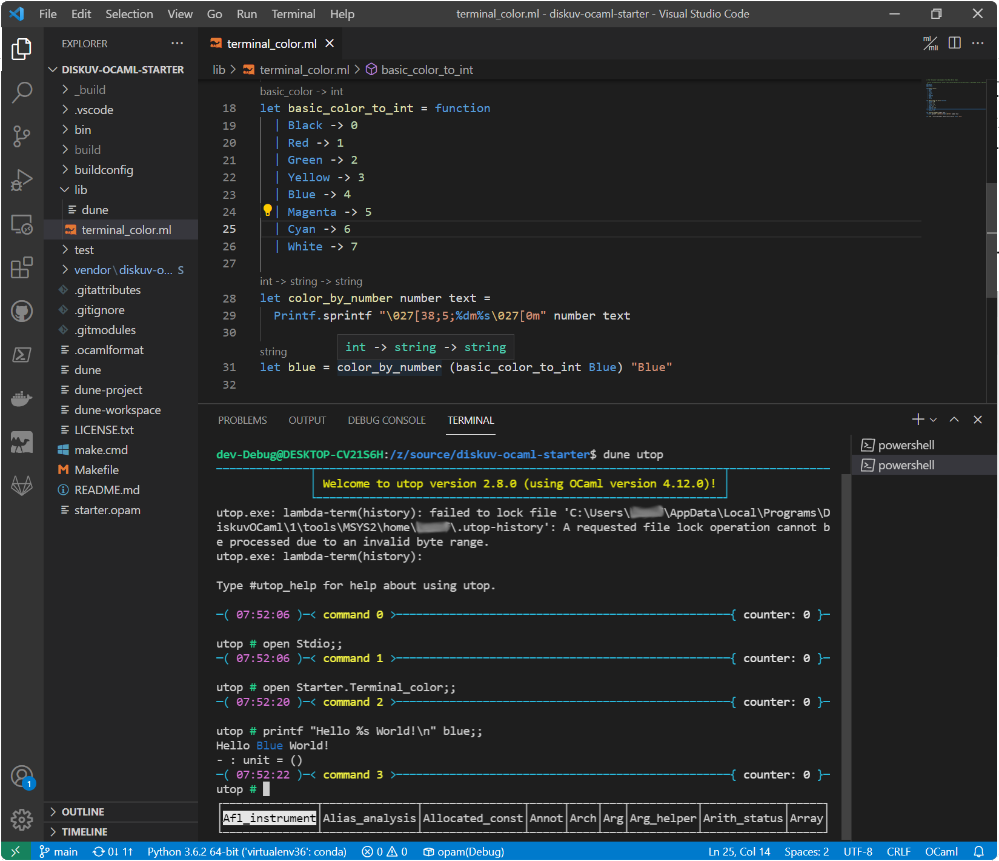

# Diskuv OCaml 0.1.1

*Diskuv OCaml* is an OCaml distribution focused on a) secure, cross-platform software development and b) ease of use for language learners and professional developers.

**Documentation is available at https://diskuv.gitlab.io/diskuv-ocaml/**

The preview versions 0.1.x run on **64-bit Windows** and:

1. Includes an installer for the initial multi-hour Windows compilation process, including the installation of Git and Visual Studio Build Tools if needed:

   

2. Includes a UNIX-compatible runtime environment for building OCaml applications with common tools like `make`, `opam` and `dune`:

   ```kotlin
    [PS Z:\source\diskuv-ocaml-starter] cd ~/DiskuvOCamlProjects/diskuv-ocaml-starter
    [PS Z:\source\diskuv-ocaml-starter] ./make build-dev
    [PS Z:\source\diskuv-ocaml-starter] _build/default/bin/main.exe
    > 1
    > 2
    > 3
    > 94.5
    > Total: 100.5
    [PS Z:\source\diskuv-ocaml-starter] ./make shell-dev
   ```

   ```lasso
    [diskuv-ocaml-starter]$ echo You are now running a UNIX shell.
    > You are now running a UNIX shell.
    [diskuv-ocaml-starter]$ opam switch --short
    > C:\Users\you\AppData\Local\Programs\DiskuvOCaml\1\system
    > Z:\source\diskuv-ocaml-starter\build\dev\Debug
    > Z:\source\diskuv-ocaml-starter\build\dev\Release
    > diskuv-boot-DO-NOT-DELETE
    [diskuv-ocaml-starter]$ dune utop
    > ──────────┬─────────────────────────────────────────────────────────────┬──────────
    >           │ Welcome to utop version 2.8.0 (using OCaml version 4.12.0)! │
    >           └─────────────────────────────────────────────────────────────┘
    >
    > Type #utop_help for help about using utop.
    >
    > ─( 06:26:11 )─< command 0 >─────────────────────────────────────────{ counter: 0 }─
   ```

   ```ocaml
    utop #> let square x = x * x ;;
    > val square : int -> int = <fun>
    utop #> square 2 ;;
    > - : int = 4
    utop #> square (square 2) ;;
    > - : int = 16
    utop #> #quit ;;
   ```

3. Works with the OCaml recommended Visual Studio Code plugin:

   

**Please visit our documentation at https://diskuv.gitlab.io/diskuv-ocaml/**


## Licensing

As a developer there is:
- a [Fair Use 5 (v0.9)](https://fair.io/) license to use the *Diskuv OCaml* distribution for **free personal use** and limited commercial use for up to 5 developers, with **broad exceptions for OCaml package maintainers**.
  See [LICENSE.txt](https://gitlab.com/diskuv/diskuv-ocaml/-/raw/main/LICENSE.txt) for the Fair Use license terms
- one or more licenses covering the distribution of your final product. Those licenses
  depend on which Opam packages you choose to include in your
  final product. Read our [documentation](https://diskuv.gitlab.io/diskuv-ocaml/#about-ocaml) for the best way to explore those packages.

> Are you an OCaml package maintainer?
> * Any patches we introduce will be released back to you under your existing license. If your project does not
>   have an explicit license then Diskuv will release the patches under the Apache v2.0 license.
> * In an upcoming release we will distribute a [OSL 3.0](https://opensource.org/licenses/OSL-3.0)
>   open source distribution so you can git submodule the *Diskuv OCaml* distribution. Among other things that will
>   let your Windows users auto-install OCaml and build your library/application without coming to this website.

License questions can be directed to support@diskuv.com.

## Acknowledgements

The *Diskuv OCaml* distribution would not be possible without many people's efforts!

In alphabetical order some of the critical pieces were provided by:

* Andreas Hauptmann (fdopen@) - Maintained the defacto Windows ports of OCaml for who knows how long
* INRIA for creating and maintaining OCaml
* Jane Street and the contributors to `dune`
* OCaml Labs and the contributors for the Visual Studio Code extension for OCaml
* OCamlPro, Jane Street and the contributors to `opam`
* Yaron Minsky, Anil Madhavapeddy and Jason Hickey for the book "Real World OCaml"
