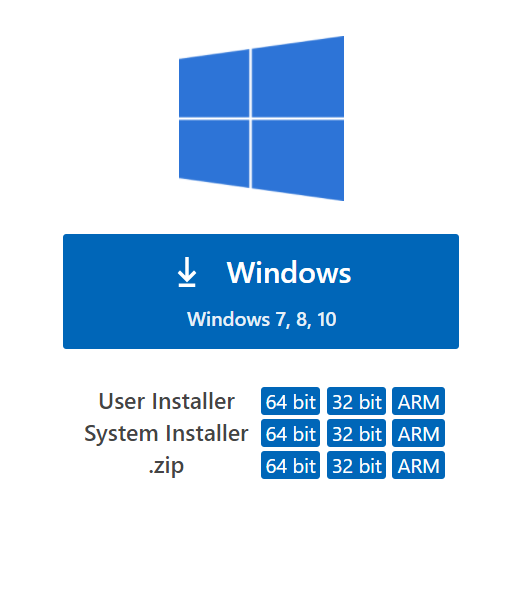

.. _Local Projects:

Local Projects
==============

Starter
-------

By now you have entered some OCaml code into ``utop`` but some key features
were missing that you can get by creating/using a local project.

A local project is a folder that contains your source code, one or more sets
of packages (other people's code) and one or more build directories to store
your compiled code and applications.

By using a local project you will be able to:

* Install other people's code packages
* Edit your source code in an IDE
* Build your source code into applications or libraries

This is easiest to see with an example.

1. Open PowerShell (press the Windows key ⊞, type "PowerShell" and then Open ``Windows PowerShell``).
2. Run the following in PowerShell:

   .. code-block:: ps1con

      PS1> cd ~\DiskuvOCamlProjects

      PS1> git clone --recursive https://gitlab.com/diskuv/diskuv-ocaml-starter.git

You now have a local project in ``~\DiskuvOCamlProjects\diskuv-ocaml-starter``!

.. warning::

    **Spaces in your project directory**

    A central part of a Local Project is the file ``Makefile``. There has been a
    `twenty year bug <http://savannah.gnu.org/bugs/?712>`_ open for
    getting GNU Make - the tool that runs the commands in ``Makefile`` - to work
    when there are spaces in directories and filenames. Please don't wait for it
    to be fixed. **Place your local projects in a directory without
    any spaces**. If your Powershell window is showing a space
    like in ``C:\Users\Jane‿Smith\DiskuvOCamlProjects`` then
    use ``C:\DiskuvOCamlProjects`` instead of ``~\DiskuvOCamlProjects``
    throughout the rest of this documentation. You may need to ask your Administrator
    to create it for you if you are on a shared PC.

We can initialize an Opam repository, assemble an Opam
switch and compile the source code all by running the single ``build-dev`` target:

.. code-block:: ps1con

    PS1> cd ~\DiskuvOCamlProjects\diskuv-ocaml-starter

    PS1> ./make build-dev DKML_BUILD_TRACE=ON

We turned on tracing (``DKML_BUILD_TRACE=ON``) so you could see what is happening;
the three steps of ``build-dev`` are:

1. Initialize an Opam repository. This takes **several minutes** but only needs to be
   done once per user (you!) per machine.
2. Assemble (create) an Opam switch by compiling all the third-party packages you
   need. Any new packages you add to ``.opam`` files will be added to your Opam switch.
   This can take **tens of minutes** but only needs to be done once per Local
   Project.
3. Compile your source code. This is usually in the **0-5 seconds** range unless your
   project is large or uses C code. There is a special Makefile target called
   ``quickbuild-dev`` that skips the first two steps and only compiles your source code.

The starter application is the `Complete Program <https://dev.realworldocaml.org/guided-tour.html>`_
example from the `Real World OCaml book <https://dev.realworldocaml.org/toc.html>`_. Let us run it.
You will enter the numbers ``1``, ``2``, ``3`` and ``94.5``, and then stop the program by
typing Ctrl-C or Enter + Ctrl-Z:

.. code-block:: ps1con

    PS1> _build/default/bin/main.exe
    > 1
    > 2
    > 3
    > 94.5
    > Total: 100.5

Recap: You fetched a Local Project, built its code and all of its dependencies, and then ran
the resulting application!

In your own projects you will likely be making edits, and then building, and then repeating
the edit and build steps over and over again. Since you already did ``build-dev`` once, use the
following to "quickly" build your Local Project:

.. code-block:: ps1con

    PS1> ./make quickbuild-dev

The next section `Integrated Development Environment (IDE)` will go over how
to automatically and almost instantaneously build your code whenever you make an edit.

Integrated Development Environment (IDE)
----------------------------------------

Installing
~~~~~~~~~~

.. sidebar:: Visual Studio Code is optional.

  Using Visual Studio Code is optional but strongly recommended! The only other development environment
  that supports OCaml well is Emacs.

Installing an IDE like Visual Studio Code will let you navigate the code in your Local Projects, see
the source code with syntax highlighting (color), get auto-complete to help you write your own code,
and inspect the types within your code.

If you haven't already, download and install `Visual Studio Code <https://code.visualstudio.com/Download>`_ from
its website. For Windows 64-bit you will want to choose the "User Installer" "64-bit" button underneath
the Windows button, unless you have Administrator access to your PC (then "System Installer" is usually the right choice):

Windows `Development Environment Virtual Machine <https://developer.microsoft.com/en-us/windows/downloads/virtual-machines/>`_
users (you will know if you are one of them) already have Visual Studio Code bundled
in the virtual machine.

OCaml Plugin
~~~~~~~~~~~~

Once you have Visual Studio Code, you will want the OCaml plugin.
Open a *new* PowerShell session and type:

.. code-block:: ps1con
    :emphasize-lines: 5,8

    PS1> iwr `
            "https://github.com/diskuv/vscode-ocaml-platform/releases/download/v1.8.5-diskuvocaml/ocaml-platform.vsix" `
            -OutFile "$env:TEMP\ocaml-platform.vsix"
    PS1> code --install-extension "$env:TEMP\ocaml-platform.vsix"
    >> Installing extensions...
    >> (node:16672) [DEP0005] DeprecationWarning: Buffer() is deprecated due to security and usability issues. Please use the Buffer.alloc(), Buffer.allocUnsafe(), or Buffer.from() methods instead.
    >> (Use `Code --trace-deprecation ...` to show where the warning was created)
    >> Extension 'ocaml-platform.vsix' was successfully installed.
    >> (node:16672) UnhandledPromiseRejectionWarning: Canceled: Canceled
    >>     at D (C:\Users\you\AppData\Local\Programs\Microsoft VS Code\resources\app\out\vs\code\node\cli.js:5:1157)
    >>     at O.cancel (C:\Users\you\AppData\Local\Programs\Microsoft VS Code\resources\app\out\vs\code\node\cli.js:9:62880)
    >>     at O.dispose (C:\Users\you\AppData\Local\Programs\Microsoft VS Code\resources\app\out\vs\code\node\cli.js:9:63012)
    >>     at N.dispose (C:\Users\you\AppData\Local\Programs\Microsoft VS Code\resources\app\out\vs\code\node\cli.js:9:63274)
    >>     at d (C:\Users\you\AppData\Local\Programs\Microsoft VS Code\resources\app\out\vs\code\node\cli.js:6:3655)
    >>     at N.clear (C:\Users\you\AppData\Local\Programs\Microsoft VS Code\resources\app\out\vs\code\node\cli.js:6:4133)
    >>     at N.dispose (C:\Users\you\AppData\Local\Programs\Microsoft VS Code\resources\app\out\vs\code\node\cli.js:6:4112)
    >>     at dispose (C:\Users\you\AppData\Local\Programs\Microsoft VS Code\resources\app\out\vs\code\node\cli.js:6:4672)
    >>     at dispose (C:\Users\you\AppData\Local\Programs\Microsoft VS Code\resources\app\out\vs\code\node\cliProcessMain.js:11:7330)
    >>     at d (C:\Users\you\AppData\Local\Programs\Microsoft VS Code\resources\app\out\vs\code\node\cli.js:6:3655)
    >>     at C:\Users\you\AppData\Local\Programs\Microsoft VS Code\resources\app\out\vs\code\node\cli.js:6:3843
    >>     at C:\Users\you\AppData\Local\Programs\Microsoft VS Code\resources\app\out\vs\code\node\cli.js:6:3942
    >>     at Object.dispose (C:\Users\you\AppData\Local\Programs\Microsoft VS Code\resources\app\out\vs\code\node\cli.js:6:762)
    >>     at d (C:\Users\you\AppData\Local\Programs\Microsoft VS Code\resources\app\out\vs\code\node\cli.js:6:3788)
    >>     at C:\Users\you\AppData\Local\Programs\Microsoft VS Code\resources\app\out\vs\code\node\cliProcessMain.js:14:41520
    >>     at Map.forEach (<anonymous>)
    >>     at Ne.dispose (C:\Users\you\AppData\Local\Programs\Microsoft VS Code\resources\app\out\vs\code\node\cliProcessMain.js:14:41496)
    >>     at d (C:\Users\you\AppData\Local\Programs\Microsoft VS Code\resources\app\out\vs\code\node\cli.js:6:3655)
    >>     at N.clear (C:\Users\you\AppData\Local\Programs\Microsoft VS Code\resources\app\out\vs\code\node\cli.js:6:4133)
    >>     at N.dispose (C:\Users\you\AppData\Local\Programs\Microsoft VS Code\resources\app\out\vs\code\node\cli.js:6:4112)
    >>     at S.dispose (C:\Users\you\AppData\Local\Programs\Microsoft VS Code\resources\app\out\vs\code\node\cli.js:6:4672)
    >>     at Object.M [as main] (C:\Users\you\AppData\Local\Programs\Microsoft VS Code\resources\app\out\vs\code\node\cliProcessMain.js:17:38649)
    >>     at async N (C:\Users\you\AppData\Local\Programs\Microsoft VS Code\resources\app\out\vs\code\node\cli.js:12:13842)
    >> (node:16672) UnhandledPromiseRejectionWarning: Unhandled promise rejection. This error originated either by throwing inside of an async function without a catch block, or by rejecting a promise which was not handled with .catch(). To terminate the node process on unhandled promise rejection, use the CLI flag `--unhandled-rejections=strict` (see https://nodejs.org/api/cli.html#cli_unhandled_rejections_mode). (rejection id: 1)
    >> (node:16672) [DEP0018] DeprecationWarning: Unhandled promise rejections are deprecated. In the future, promise rejections that are not handled will terminate the Node.js process with a non-zero exit code.

You may get a lot of warnings/noise, but the highlighted lines will show you that the installation was successful.

Now you need to quit **ALL** Visual Studio Code windows (if any), and then restart Visual Studio Code.

*Advanced Users: Diskuv OCaml has made a change to the OCaml plugin to better support Windows,
but a new version of the plugin has yet to be released.  Until it is released,
we have given you a pre-release version.*

Visual Studio Code Development
~~~~~~~~~~~~~~~~~~~~~~~~~~~~~~

1. Launch Visual Studio Code
2. Open the folder (File > Open Folder; or Ctrl+K Ctrl+O) ``%USERPROFILE%\DiskuvOCamlProjects\diskuv-ocaml-starter``
3. Open a Terminal (Terminal > New Terminal; or Ctrl+Shift+`). In the terminal type:

   .. code-block:: ps1con

        [diskuv-ocaml-starter]$ ./make dkml-devmode
        >> while true; do \
        >>         DKML_BUILD_TRACE=OFF vendor/diskuv-ocaml/runtime/unix/platform-dune-exec -p dev -b Debug \
        >>                 build --watch --terminal-persistence=clear-on-rebuild \
        >>                 bin lib   test ; \
        >>         sleep 5 || exit 0; \
        >> done
        >> Scanned 0 directories
        >> fswatch args = (recursive=true; event=[Removed; Updated; Created];
        >>                 include=[];
        >>                 exclude=[4913; /#[^#]*#$; ~$; /\..+; /_esy; /_opam; /_build];
        >>                 exclude_auto_added=[\\#[^#]*#$; \\\..+; \\_esy; \\_opam; \\_build; \\\.git; \\_tmp];
        >>                 paths=[.])
        >> inotifywait loc = C:\Users\beckf\AppData\Local\Programs\DiskuvOCaml\1\tools\inotify-win\inotifywait.exe
        >> inotifywait args = [--monitor; --format; %w\%f; --recursive; --event; delete,modify,create; --excludei; 4913|/#[^#]*#$|~$|/\..+|/_esy|/_opam|/_build|\\#[^#]*#$|\\\..+|\\_esy|\\_opam|\\_build|\\\.git|\\_tmp; .]
        >> Done: 0/0 (jobs: 0)===> Monitoring Z:\source\diskuv-ocaml-starter -r*.* for delete, modify, create
        >> Success, waiting for filesystem changes...

   Keep this Terminal open for as long as you have the local project (in this case ``diskuv-ocaml-starter``) open.
   It will watch your local project for any changes you make and then automatically build them.

   The automatic building uses
   `Dune's watch mode <https://dune.readthedocs.io/en/stable/usage.html#watch-mode>`_;
   its change detection and compile times should be almost instantaneous for most
   projects.

4. Open another Terminal. In this terminal you can quickly test some pieces of your code.
   To test ``lib/dune`` and ``lib/terminal_color.ml`` which come directly from the
   `Real World OCaml book <https://dev.realworldocaml.org/variants.html>`_ you would type:

   .. code-block:: ps1con

        PS Z:\source\diskuv-ocaml-starter> ./make shell-dev
        >> diskuv-ocaml-starter$

   .. code-block:: shell-session

        [diskuv-ocaml-starter]$ dune utop
        > ──────────┬─────────────────────────────────────────────────────────────┬──────────
        >           │ Welcome to utop version 2.8.0 (using OCaml version 4.12.0)! │
        >           └─────────────────────────────────────────────────────────────┘
        >
        > Type #utop_help for help about using utop.
        >
        > ─( 06:26:11 )─< command 0 >─────────────────────────────────────────{ counter: 0 }─
        > utop #
   .. code-block:: tcshcon

        utop #> #show Starter;;
        > module Starter : sig module Terminal_color = Starter.Terminal_color end
        utop #> #show Starter.Terminal_color;;
        > module Terminal_color = Starter.Terminal_colormodule Terminal_color :
        > sig
        >   type basic_color =
        >       Black
        >     | Red
        >     | Green
        >     | Yellow
        >     | Blue
        >     | Magenta
        >     | Cyan
        >     | White
        >   val basic_color_to_int : basic_color -> int
        >   val color_by_number : int -> string -> string
        >   val blue : string
        > end
        utop #> open Stdio;;
        utop #> open Starter.Terminal_color;;
        utop #> printf "Hello %s World!\n" blue;;
        > Hello Blue World!
        > - : unit = ()
        utop #> #quit;;
5. Open the source code ``bin/main.ml`` and ``lib/terminal_color.ml`` in the editor.
   When you hover over the text you should see type information popup.
6. Change the indentation of ``bin/main.ml`` and ``lib/terminal_color.ml``. Then
   press Shift + Alt + F (or go to View > Command Palette and type "Format Document").
   You should see your code reformatted.

At this point you should be able to complete the first
`5 chapters of Real World OCaml <https://dev.realworldocaml.org/toc.html>`_.

Finished?

*TODO* Missing a tool to make your own Local Project.

It needs to include:

.. code-block:: ps1con

    PS1> git submodule add `
            https://gitlab.com/diskuv/diskuv-ocaml.git `
            vendor/diskuv-ocaml

Standard Layout
---------------

``diskuv-ocaml-starter`` is an example of the standard layout which looks like:

::

    .
    ├── bin
    │   ├── dune
    │   └── main.ml
    ├── build
    │   ├── _tools
    │   │   └── dev
    │   └── dev
    │       └── Debug
    ├── buildconfig
    │   └── dune
    │       ├── dune.env.workspace.inc
    │       ├── executable
    │       └── workspace
    ├── dune
    ├── dune-project
    ├── dune-workspace
    ├── lib
    │   ├── dune
    │   └── terminal_color.ml
    ├── LICENSE.txt
    ├── make.cmd
    ├── Makefile
    ├── README.md
    ├── starter.opam
    ├── test
    │   ├── dune
    │   └── starter.ml
    └── vendor
        └── diskuv-ocaml

*TODO* Explanation of each directory and file.

Setting Up An Existing Git Repository As a Local Project
--------------------------------------------------------

The directory structure does _not_ need to look like the standard layout.

The requirements are:

1. There must be a ``dune-project`` in an ancestor directory of the ``diskuv-ocaml-starter`` Git submodule.
   For example, it is fine to have:

   ::

        .git/
        .gitmodules
        a/
            b/
                dune-project
                src/
                    c/
                        d/
                            diskuv-ocaml-starter/

*TODO* Complete.

Upgrading
---------

Run:

.. code-block:: ps1con

    PS1> .\vendor\diskuv-ocaml\runtime\windows\upgrade.ps1

If there is an upgrade of ``Diskuv OCaml`` available it will automate as much as possible,
and if necessary give you further instructions to complete the upgrade.
