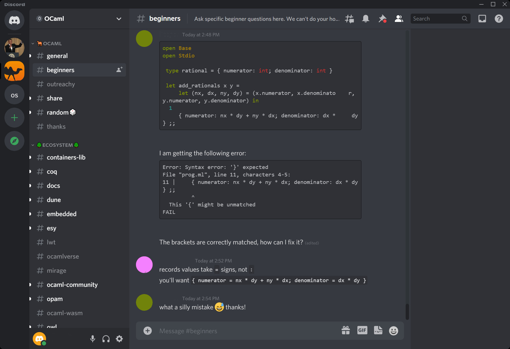

Getting Started with Diskuv OCaml
=================================

.. sidebar:: First time visiting us?

   The `Introduction`_ section is the best place to start!

.. toctree::
   :maxdepth: 2
   :caption: Table of Contents

   self
   doc/LocalProject
   doc/Troubleshooting
   doc/OpamIntegration
   doc/Advanced
   doc/FutureExtensions

Introduction
------------

This section is about getting started with *Diskuv OCaml*. We will begin by giving you a brief overview of
where to learn about OCaml, show you what you will get with the *Diskuv OCaml* distribution, and finish with how to get
the *Diskuv OCaml* distribution installed on your system.

About OCaml
-----------

There are a few webpage that you should have bookmarked as you learn about OCaml. The first is
the official OCaml website's `What's OCaml? <https://ocaml.org/learn/description.html>`_ which has a comprehensive list of features
that OCaml provides (the sales pitch!), and a good summary of OCaml:

    OCaml is a general purpose programming language with an emphasis on expressiveness and safety. Developed
    for more than 20 years at `Inria <http://www.inria.fr/en>`_ by a group of leading researchers, it has an
    advanced type system that helps catch your mistakes without getting in your way. It's used in environments
    where `a single mistake can cost millions and speed matters <https://ocaml.org/learn/companies.html>`_, is
    supported by an active community, and has a rich set of libraries and development tools.

Then we recommend looking at the free online book
`Real World OCaml <https://dev.realworldocaml.org/index.html>`_. It will guide you through the language and
explore each of OCaml's major features. You will need a distribution of OCaml to follow along. Windows users
will need to use the *Diskuv OCaml* distribution (there are other ways to install OCaml on Windows, but they
are difficult or deprecated), while Linux and macOS users have choices explained in the book. We will
discuss *Diskuv OCaml* in the next section.

Once you start writing your own code you will need to know where to look to find libraries (called **packages** in
OCaml). We recommend just browsing the packages at
`OCamlPro's OCaml Documentation Hub <https://docs.ocaml.pro/about.html>`_ since it is fairly comprehensive,
reasonably up-to-date and has links to most package's documentation. Just click on its
`Packages tab <https://docs.ocaml.pro/packages.html>`_ and do a text search with Ctrl-F or ⌘-F:

.. image:: https://docs.ocaml.pro/static/imgs/index-page.png
  :width: 400
  :alt: OCamlPro OCaml Documentation Hub Main Index

|

.. image:: https://docs.ocaml.pro/static/imgs/package-page.png
  :width: 400
  :alt: OCamlPro OCaml Documentation Hub Package Info for AHROCKSDB.0.2.2

|

Finally, if you hit a roadblock the best place to go is the `Discord chat rooms <https://tinyurl.com/discord-ocaml>`_
and ask your question on the ``#beginners`` channel:

|

About Diskuv OCaml
------------------

*Diskuv OCaml* is an OCaml distribution focused on a) secure, cross-platform software development and b) ease of use
for language learners and professional developers.

Diskuv, a company creating safe communications solutions, adopted the OCaml language because OCaml is the thought
leader for formally verified software (a fancy term for proving that software is secure) while being
portable due to compatibility with the C language. However, OCaml development used to require a lot of tribal knowledge.
For example the `Unison File Sychronizer <https://github.com/bcpierce00/unison#unison-file-synchronizer>`_ which can
synchronize folders between different operating systems (pretty cool!) was developed in OCaml and has been available on
macOS, Linux and Windows for decades. Yet the
`defacto Windows distribution of OCaml <https://fdopen.github.io/opam-repository-mingw/2021/02/26/repo-discontinued/>`_
was deprecated in 2021! The online book
`Real World OCaml <https://dev.realworldocaml.org/index.html>`_ solved much of the tribal knowledge problem but you will
likely run into some roadblocks. Several companies and groups have filled the void
(Jane Street, OCaml Labs, OCaml Pro and Facebook among others). *Diskuv OCaml* provides a few critical functions:

1. A way to install a coherent set of software that has been vetted to work together. Especially but not only on Windows.
2. A way to upgrade that software, usually in response to security patches or critical bug fixes.
3. A support channel when things go wrong.

.. note::

  The first releases (0.1.x) of Diskuv OCaml support Windows 64-bit systems only, and should be
  considered preview releases.

The *Diskuv OCaml* distribution includes the following OCaml components:

- The basic OCaml system including:

  ocamlc
    `The batch compiler <https://ocaml.org/manual/comp.html>`_
  ocaml
    `The toplevel system <https://ocaml.org/manual/toplevel.html>`_ or REPL.
    *We also include a full-featured toplevel; see utop below*
  ocamlrun
    `The runtime system <https://ocaml.org/manual/runtime.html>`_
  ocamlopt
    `The native-code compiler <https://ocaml.org/manual/native.html>`_
  ocamllex, ocamlyacc
    `Lexer and parser generators <https://ocaml.org/manual/lexyacc.html>`_
  ocamldep
    `The dependency generator <https://ocaml.org/manual/depend.html>`_
  ocamldoc
    `The documentation generator <https://ocaml.org/manual/ocamldoc.html>`_
  ocamldebug
    `The debugger <https://ocaml.org/manual/debugger.html>`_
  ocamlprof
    `The profiler <https://ocaml.org/manual/profil.html>`_
  ocamlmklib
    `The mixed C/OCaml library maker <https://ocaml.org/manual/intfc.html>`_
- opam
    `Opam <https://opam.ocaml.org/>`_, the standard package manager for OCaml
- dune
    `Dune <https://dune.readthedocs.io/>`_, the standard build tool for OCaml
- utop
    `UTop <https://github.com/ocaml-community/utop#readme>`_, the standard "toplevel" for interactively running
    OCaml code
- ocamllsp
    `OCaml Language Server <https://github.com/ocaml/ocaml-lsp#ocaml-lsp>`_ for use with
    OCaml friendly IDEs like Visual Studio Code and Emacs
- ocamlformat and ocamlformat-rpc
    `OCamlFormat <https://github.com/ocaml-ppx/ocamlformat#readme>`_, the standard auto-formatter for OCaml code
  ocp-indent
    `ocp-indent <http://www.typerex.org/ocp-indent.html>`_, the standard indenter for mixed OCaml/non-OCaml documents
- findlib
    `Findlib <http://projects.camlcity.org/projects/findlib.html>`_, the standard library manager for OCaml modules
- flexdll
    `FlexDLL <https://github.com/alainfrisch/flexdll#readme>`_ for expert users who are creating dynamic plugins

and it also includes some C-language components for the cross-platform tooling we will be releasing in the future:

- cmake
    `CMake <https://cmake.org/>`_, the standard high-level build tool for C and C++ projects
- ninja
    `Ninja <https://ninja-build.org/>`_, a low level build tool primarily for C projects
- vcpkg
    `vcpkg <https://vcpkg.io>`_, a C/C++ package manager for acquiring and managing libraries

The *Diskuv OCaml* distribution will automatically install the following components if missing from your system:

- git
    `Git <https://git-scm.com/book/en/v2/Getting-Started-About-Version-Control>`_, the standard version control for
    getting, saving and sharing source code.
- cl, link
    `Visual Studio Build Tools <https://docs.microsoft.com/en-us/visualstudio/install/workload-component-id-vs-build-tools?view=vs-2019#desktop-development-with-c>`_,
    the official Microsoft tools for building modern C/C++ apps for Windows

.. _How to Install:

How to Install
--------------

.. note::

   These instructions are currently only for Windows developers.

Requirements
~~~~~~~~~~~~

- 64-bit Windows 10 or 64-bit Windows 11. *More operating systems will be coming.*
- A fast internet connection. You will be downloading tens of gigabytes of data.
- 30GB of disk space.
- Administrator access on your computer to install the Microsoft C compilers. If you use a shared or restricted PC,
  please ask your PC administrator if they can follow the :ref:`Advanced - Windows Administrator` instructions; after that you
  and others on the PC can install without Administrator access.
- You don't need to watch the installation, but you do need to keep your computer powered on for at least 4
  hours. The *Diskuv OCaml* installer will be downloading and doing intensive compilation during these hours,
  and you are free to do other things on your computer while it downloads and compiles.

Two-Step Installation Instructions
~~~~~~~~~~~~~~~~~~~~~~~~~~~~~~~~~~

ONE. *Download the distribution.*
"""""""""""""""""""""""""""""""""

1. Open PowerShell (press the Windows key ⊞, type "PowerShell" and then Open ``Windows PowerShell``).
2. Run the following in PowerShell to fetch the starter project from its Git repository:

  .. code-block:: ps1con

    PS> (Test-Path -Path ~\DiskuvOCamlProjects) -or $(ni ~\DiskuvOCamlProjects -ItemType Directory)

    PS> iwr `
      "https://gitlab.com/api/v4/projects/diskuv%2Fdiskuv-ocaml/packages/generic/portable-distribution/0.1.1/portable-distribution.zip" `
      -OutFile "$env:TEMP\diskuv-ocaml-distribution.zip"

    PS> Expand-Archive `
      -Path "$env:TEMP\diskuv-ocaml-distribution.zip" `
      -DestinationPath ~\DiskuvOCamlProjects `
      -Force

TWO. *Run the Install World script.*
""""""""""""""""""""""""""""""""""""

.. warning::

  **Be prepared to wait for at least 4 hours for the installer to finish.** In the meantime you can still use your
  computer for other things like web browsing.

1. Open PowerShell (press the Windows key ⊞, type "PowerShell" and then Open ``Windows PowerShell``) if
   it is not already open.
2. Run the following in PowerShell to run the installer script:

   .. code-block:: ps1con

     PS> cd ~\DiskuvOCamlProjects\diskuv-ocaml

     PS> Set-ExecutionPolicy `
          -ExecutionPolicy Unrestricted `
          -Scope Process `
          -Force

     PS> installtime\windows\install-world.ps1

   Depending on your Windows "User Account Control" settings your machine may prompt to click "Yes"
   to install ``Visual Studio Installer`` and ``Git for Windows``; you will only be prompted if you or an
   Administator has not installed those two programs already. The rest of the installation is completely
   click-free:

   .. image:: doc/Intro-install-world.png
      :width: 600

Install is done! What next?
"""""""""""""""""""""""""""

You have completed the installation of *Diskuv OCaml*. Let us try some of the things you can do right now.

1. Open PowerShell (press the Windows key ⊞, type "PowerShell" and then Open ``Windows PowerShell``).
   Do not re-use an old PowerShell window since it will know nothing about the new installation you just did.
2. Run the ``utop`` application.

   .. code-block:: ps1con

      PS> utop
      > ──────────┬─────────────────────────────────────────────────────────────┬──────────
      >           │ Welcome to utop version 2.8.0 (using OCaml version 4.12.0)! │
      >           └─────────────────────────────────────────────────────────────┘
      >
      > Type #utop_help for help about using utop.
      >
      > ─( 19:03:24 )─< command 0 >─────────────────────────────────────────{ counter: 0 }─
      > utop #

3. You may get some harmless warnings (ex. ``failed to lock file``) that you can safely ignore. Now
   let us try to enter some basic OCaml expressions ... be sure to
   include the ``;;`` and then press ENTER after each line:

   .. code-block:: tcshcon

      utop #> 3.5 +. 6. ;;
      > - : float = 9.5
      utop #> 30_000_000 / 300_000 ;;
      > - : int = 100
      utop #> let square x = x * x ;;
      > val square : int -> int = <fun>
      utop #> square 2 ;;
      > - : int = 4
      utop #> square (square 2) ;;
      > - : int = 16

4. You probably want to do a lot more than that! You may want to edit your code in a easy-to-use editor
   with syntax highlighting, type inspection and auto-complete
   (an "integrated development environment" or more simply an **IDE**). You may also want to use other
   people's code packages. Right now if you tried to use the ``Base`` package, for example, you will get
   an error:

   .. code-block:: tcshcon

      utop #> open Base ;;
      > Error: Unbound module Base

5. Leave the ``utop`` application by typing:

  .. code-block:: tcshcon

    utop #> #quit ;;

:ref:`Local Projects`, which let you edit code in an IDE and import code packages, are
the topic of the next section.

Indices and tables
==================

* :ref:`genindex`
* :ref:`modindex`
* :ref:`search`
